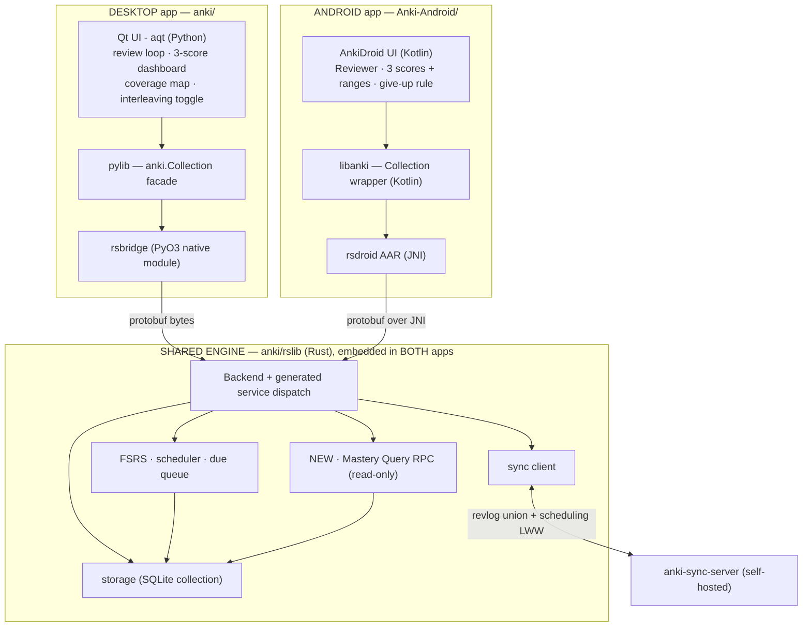
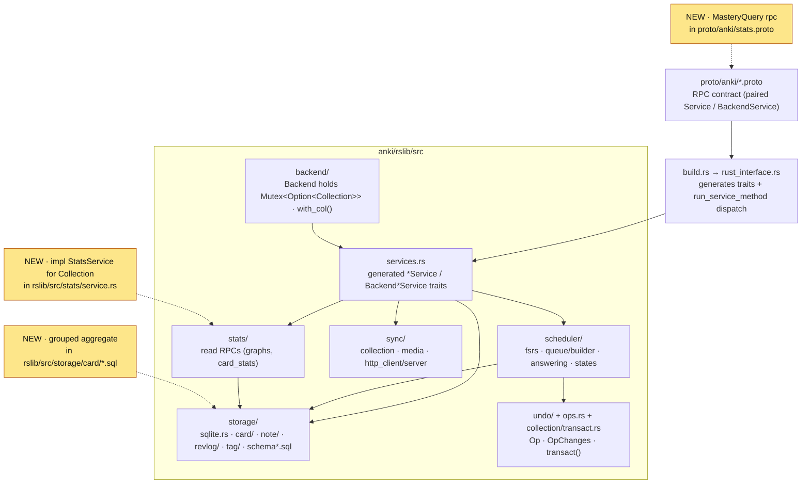
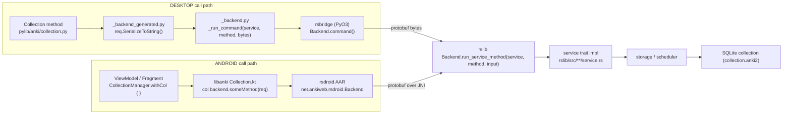
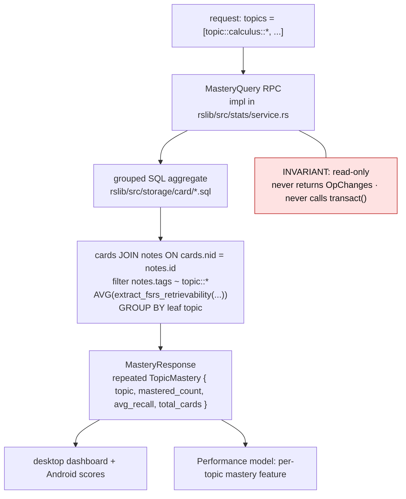
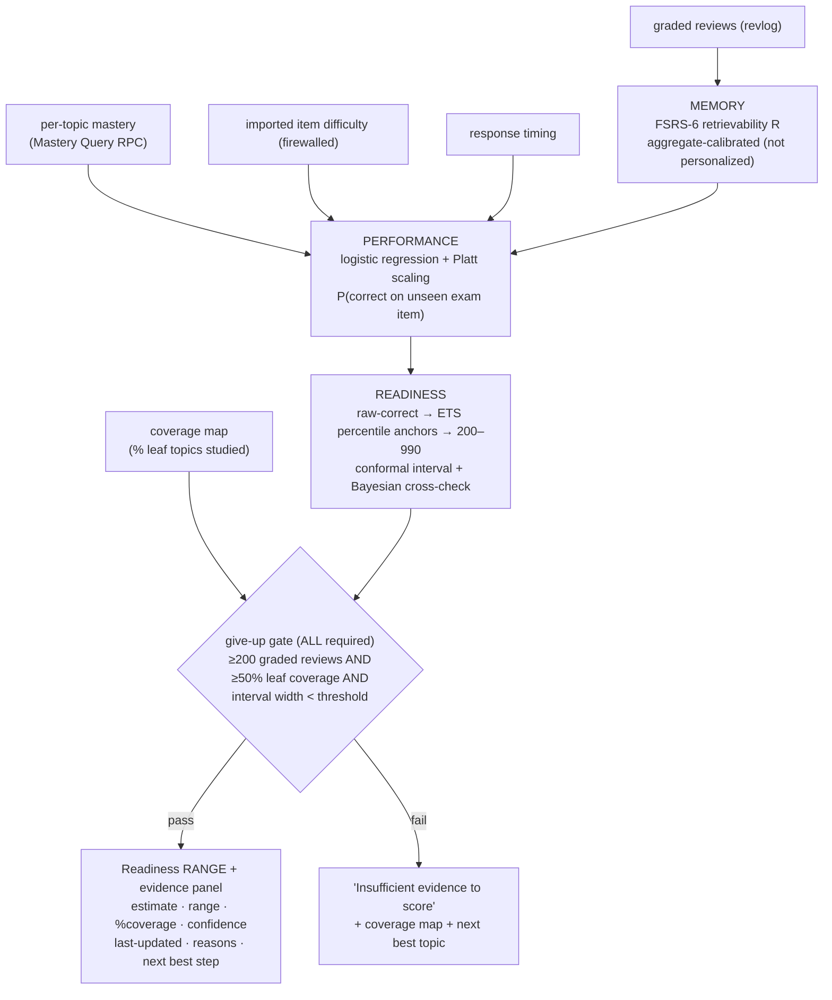
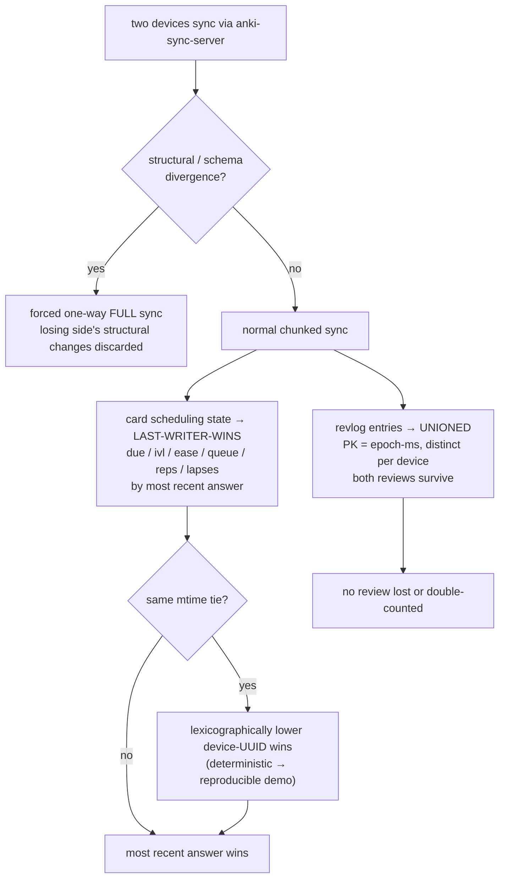

# Anki Fork Architecture Map

> Central map for this GRE Math Subject speedrun. Read this first, then the per-area docs in
> `docs/codebase/INDEX.md`. Every path here was verified against the vendored source at the SHAs in
> the footer. See `docs/PRD.md` for *why* (product) and `docs/execution-plan.md` for *when*.

**Repo layout note.** The outer `speedrun/` folder is not yet a git repo; the two upstream forks are
vendored as sibling folders (`anki/`, `Anki-Android/`) and are slated to become submodules. Our
codebase docs live **centrally here**, not co-located inside the forks, so they don't pollute
upstream code or complicate the eventual merge/submodule wiring.

---

## Big picture

The system is **two client apps over one shared Rust engine**.

- **The engine** is Anki's `rslib` (Rust): FSRS scheduling, the due-card queue, SQLite storage,
  collection sync, and undo/transaction management. Every capability is exposed as a **protobuf
  RPC**. The engine is the single source of truth for card state; clients never reimplement
  scheduling.
- **The desktop app** (`anki/`) is Qt + Python (`aqt`). Python reaches the engine through `pylib`
  (the `anki` package) and the `rsbridge` PyO3 native module: a method call serialises a protobuf
  request, crosses into Rust, and parses the protobuf response.
- **The Android app** (`Anki-Android/`) is AnkiDroid (Kotlin). Its `libanki` module reaches the
  **same `rslib`** through the external `rsdroid` AAR over JNI — again as protobuf in/out.
- **Sync** is how the two runtimes reconcile: each app embeds its own compiled copy of `rslib` and
  they exchange data through a self-hosted `anki-sync-server` (revlog unioned, scheduling
  last-writer-wins — see Diagram 6).

Our project adds exactly one engine change — a **read-only Mastery Query RPC** (PRD §5) — plus
score/AI/UX layers that sit *above* the engine so they can be switched off without touching the
review loop. The `topic::<bucket>::<leaf>` **tag taxonomy** (PRD §6, Appendix A) is the keystone:
one tag tree feeds the mastery query, the coverage map, the readiness gate, and interleaving.

### Diagram 1 — System / container view

*Each app embeds its own build of `rslib` (desktop via `rsbridge`, Android via `rsdroid`); the single
"engine" box represents that shared codebase. The two running instances reconcile through the sync
server.*

---

## Areas

| Area | Code path(s) | Doc | Verified at |
|---|---|---|---|
| Rust engine | `anki/rslib/` | `docs/codebase/rslib.md` | `anki@25.09.4` (`d52ca66`) |
| Protobuf / RPC boundary | `anki/proto/`, `anki/rslib/build.rs`, `anki/rslib/rust_interface.rs`, `anki/rslib/proto_gen/` | `docs/codebase/proto-rpc.md` | `anki@25.09.4` (`d52ca66`) |
| Python bindings / FFI | `anki/pylib/` (`rsbridge/`, `anki/_backend.py`, `anki/collection.py`) | `docs/codebase/pylib.md` | `anki@25.09.4` (`d52ca66`) |
| Qt desktop UI | `anki/qt/` (`aqt/`), `anki/ts/` | `docs/codebase/qt.md` | `anki@25.09.4` (`d52ca66`) |
| Android (rsdroid) | `Anki-Android/libanki/`, `Anki-Android/AnkiDroid/`, external `rsdroid` AAR | `docs/codebase/rsdroid.md` | `Anki-Android@v2.24.0` (`ebcf8e0`); backend `0.1.64-anki25.09.2` |
| Our app additions (mastery query, dashboard, interleaving) | *(not built yet)* | planned — see PRD §5/§7/§8 | n/a |
| Scoring models (memory / performance / readiness) | *(not built yet — Python sidecar)* | planned — see PRD §7 | n/a |
| Sync conflict rules | builds on `anki/rslib/src/sync/` | planned — see PRD §10 / D3 | n/a |
| AI card pipeline | *(not built yet)* | planned — see PRD §9 | n/a |

### Diagram 2 — `rslib` engine module map

Where the engine's pieces live and where the new Mastery Query attaches (highlighted).

### Diagram 3 — RPC + FFI boundary (both clients converge on the same engine)

### Diagram 4 — Mastery Query data flow (the read-only Rust change)

### Diagram 5 — Three-score pipeline + give-up gate (planned, PRD §7)

*The three scores are **never blended** — each is shown separately, always with a range.*

### Diagram 6 — Sync conflict resolution (planned, PRD §10 / D3; mirrors Anki's model)

---

## Cross-cutting concerns

### Build & protobuf/RPC codegen
The protobuf files in `anki/proto/anki/*.proto` are the **contract**. The build compiles them to a
descriptor set, then generates: Rust message types (prost) + the service traits and dispatch
(`anki/rslib/build.rs` → `anki/rslib/rust_interface.rs` → `OUT_DIR/backend.rs`, included by
`anki/rslib/src/services.rs`); the Python layer (`_backend_generated.py` + `*_pb2.py`); and the
TypeScript layer for the web UI. **You never hand-edit generated code** — change the `.proto`, then
implement the trait method in Rust and add a thin client wrapper. Full detail: `proto-rpc.md`.

### FFI boundaries
Two boundaries cross into the same Rust engine, both carrying protobuf bytes:
- **Desktop:** Python → `rsbridge` (PyO3) → Rust (`Backend.command(service, method, bytes)`). See `pylib.md`.
- **Android:** Kotlin → `rsdroid` AAR (JNI) → Rust (`net.ankiweb.rsdroid.Backend`). See `rsdroid.md`.

Our Mastery Query must reach **both**: implementing it in `rslib` gives desktop access immediately,
but Android additionally needs the `rsdroid` AAR rebuilt against an `rslib` that contains the change
(and the version bumped in `Anki-Android/gradle/libs.versions.toml`). **Version skew to reconcile:**
desktop is pinned to `anki@25.09.4`, AnkiDroid's backend is `0.1.64-anki25.09.2`.

### Undo / transaction model (a hard ceiling)
Mutations go through `Collection::transact(op, ...)` (`anki/rslib/src/collection/transact.rs`), which
opens an undoable operation and returns an `OpChanges` describing what changed; clients use that to
refresh the UI. **Read RPCs must NOT return `OpChanges` and must NOT call `transact`.** This is the
structural guarantee that the Mastery Query cannot corrupt the collection or break undo (PRD §5.3).
Encode it as a test: undo stack + study-queue counts byte-for-byte unchanged after the call.

### The topic-tag taxonomy (data keystone)
Topic metadata lives in **Anki tags** (`notes.tags`), not a new schema column — a new column would
bump `SCHEMA_MAX_VERSION` (currently `18`, in `anki/rslib/src/storage/upgrades/mod.rs`) and break
sync round-trips. Hierarchical `topic::<bucket>::<leaf>` tags are the shared substrate for the
mastery query, coverage map, readiness gate, and interleaving (PRD §6, Appendix A).

### Sync
Anki's decade-tested sync (`anki/rslib/src/sync/`) unions the revlog and chunks card/note/deck
changes; structural divergence forces a one-way full sync. Our conflict policy (Diagram 6) layers a
deterministic device-UUID tie-break on top so the conflict demo is reproducible. The test harness is
the built-in Rust `anki-sync-server` (`anki/rslib/sync/main.rs`), pinned to our release tag.

---

Last verified against: `anki@25.09.4` (`d52ca66`), `Anki-Android@v2.24.0` (`ebcf8e0`), rsdroid backend `0.1.64-anki25.09.2`
